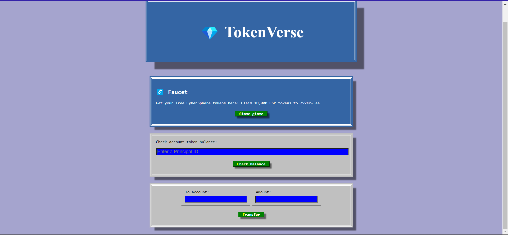
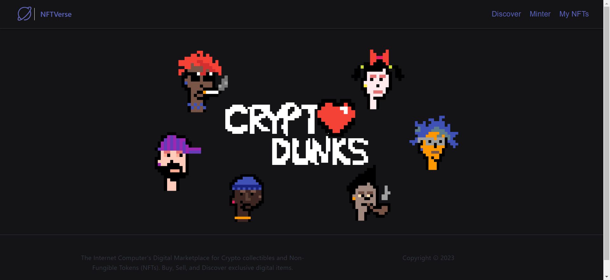
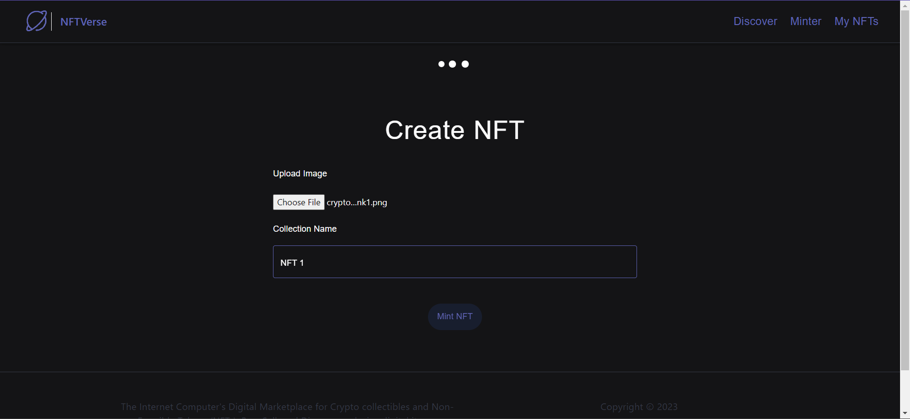
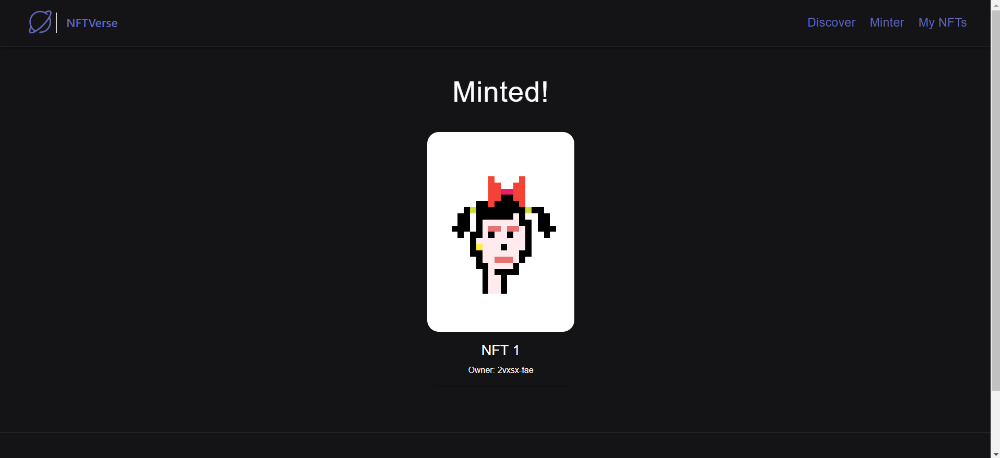
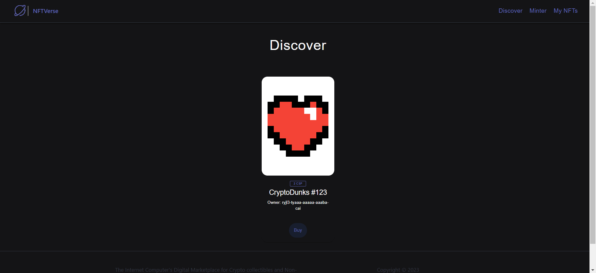
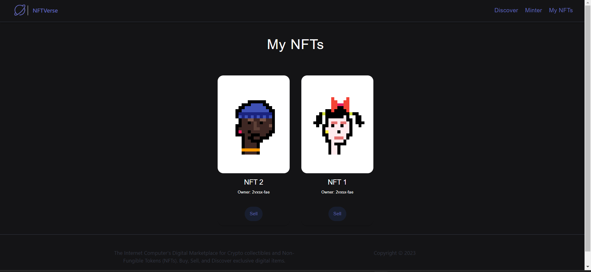
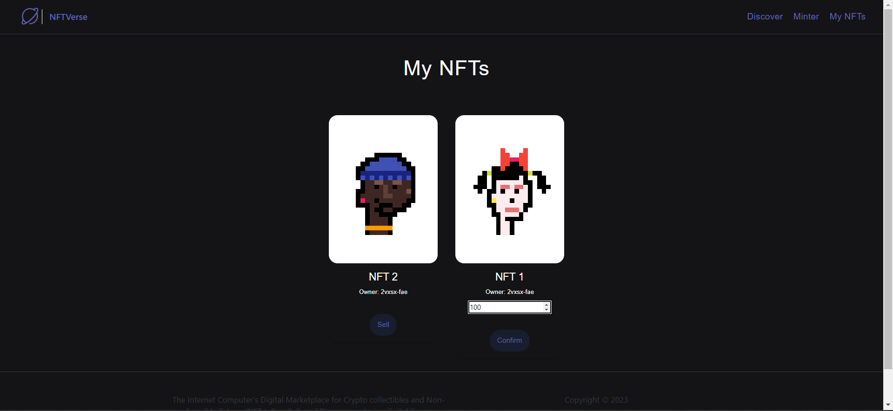
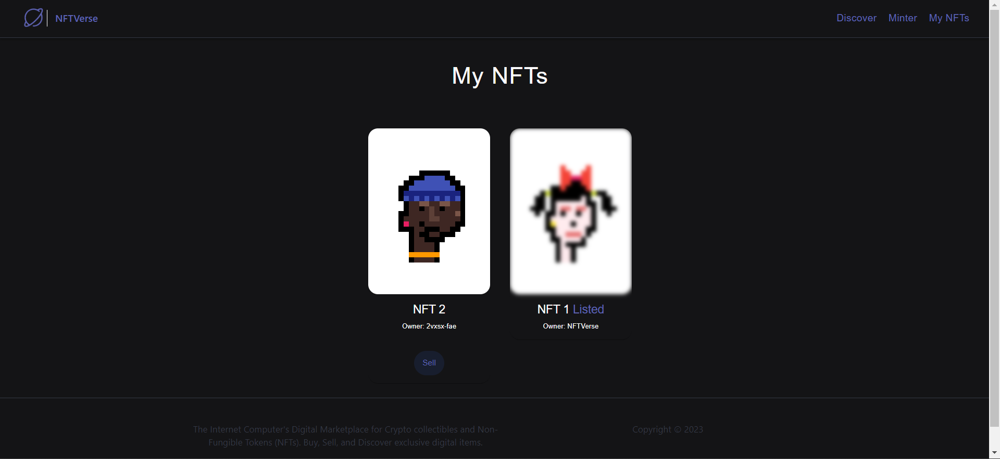

# NFTVerse

Created a Decentralized Crypto Token ”CSP” from scratch on ICP Blockchain Network using back-end logic in Motoko Smart Contracts. Developed a NFT marketplace using React and Motoko where users can discover NFT collections, buy from it, mint NFTs and list their NFTs for sale. Integrated the CSP token wallet as a payment method for the transactions.

# Features

1. User can claim their free CSP token from the CSP Faucet.
2. User links this CSP Wallet to the NFTVerse marketplace and all the transactions are completed from the same wallet.
3. On the Discover page user can find NFTs minted by other users listed on listing HashMap with their price and owner id.
4. User can buy NFTs from Discover page and the ownership is transferred to the user and the amount is deducted from the user's CSP wallet and deposited to the seller.
5. User can find out owned and self minted NFTs in My-NFT section of the application.
6. User can list his/her NFTs for sale and once listed they are shown in Discover section and the image in blurred with the status listed on My-NFT page.
7. User-listed NFTs are owned by the NFTVerse platform and User can't buy his/her own listed NFTs.
8. User can mint new NFTs using experimental cycles and minted NFTs are added to the My-NFT section.
9. In order to mint NFTs as 3rd party we can use command line function calls using dfx.

# Tech

1. Frontend: HTML, CSS, ES6, JavaScript, React, React-router, React-hooks
2. Backend: Motoko smart contracts and Internet Computer

# Screenshots

1. CSP Token Wallet



2. Homepage



3. Minting NFT





4. Discover 



5. My collection



6. Setting price for sale



7. Sale confirmed




# To Install and Run the Project

1. start local dfx

```
dfx start --clean
```

2. Run NPM server

```
npm start
```

3. Deploy canisters

```
dfx deploy --argument='("Crypto heart #123", principal "<Your_prinipal_ID>", (vec {137; 80; 78; 71; 13; 10; 26; 10; 0; 0; 0; 13; 73; 72; 68; 82; 0; 0; 0; 10; 0; 0; 0; 10; 8; 6; 0; 0; 0; 141; 50; 207; 189; 0; 0; 0; 1; 115; 82; 71; 66; 0; 174; 206; 28; 233; 0; 0; 0; 68; 101; 88; 73; 102; 77; 77; 0; 42; 0; 0; 0; 8; 0; 1; 135; 105; 0; 4; 0; 0; 0; 1; 0; 0; 0; 26; 0; 0; 0; 0; 0; 3; 160; 1; 0; 3; 0; 0; 0; 1; 0; 1; 0; 0; 160; 2; 0; 4; 0; 0; 0; 1; 0; 0; 0; 10; 160; 3; 0; 4; 0; 0; 0; 1; 0; 0; 0; 10; 0; 0; 0; 0; 59; 120; 184; 245; 0; 0; 0; 113; 73; 68; 65; 84; 24; 25; 133; 143; 203; 13; 128; 48; 12; 67; 147; 94; 97; 30; 24; 0; 198; 134; 1; 96; 30; 56; 151; 56; 212; 85; 68; 17; 88; 106; 243; 241; 235; 39; 42; 183; 114; 137; 12; 106; 73; 236; 105; 98; 227; 152; 6; 193; 42; 114; 40; 214; 126; 50; 52; 8; 74; 183; 108; 158; 159; 243; 40; 253; 186; 75; 122; 131; 64; 0; 160; 192; 168; 109; 241; 47; 244; 154; 152; 112; 237; 159; 252; 105; 64; 95; 48; 61; 12; 3; 61; 167; 244; 38; 33; 43; 148; 96; 3; 71; 8; 102; 4; 43; 140; 164; 168; 250; 23; 219; 242; 38; 84; 91; 18; 112; 63; 0; 0; 0; 0; 73; 69; 78; 68; 174; 66; 96; 130;}))'
```

4. Head to localhost

http://localhost:8080/


# Creating NFT for Testing

1. Mint an NFT on the command line to get NFT into mapOfNFTs:

```
dfx canister call opend mint '(vec {137; 80; 78; 71; 13; 10; 26; 10; 0; 0; 0; 13; 73; 72; 68; 82; 0; 0; 0; 10; 0; 0; 0; 10; 8; 6; 0; 0; 0; 141; 50; 207; 189; 0; 0; 0; 1; 115; 82; 71; 66; 0; 174; 206; 28; 233; 0; 0; 0; 68; 101; 88; 73; 102; 77; 77; 0; 42; 0; 0; 0; 8; 0; 1; 135; 105; 0; 4; 0; 0; 0; 1; 0; 0; 0; 26; 0; 0; 0; 0; 0; 3; 160; 1; 0; 3; 0; 0; 0; 1; 0; 1; 0; 0; 160; 2; 0; 4; 0; 0; 0; 1; 0; 0; 0; 10; 160; 3; 0; 4; 0; 0; 0; 1; 0; 0; 0; 10; 0; 0; 0; 0; 59; 120; 184; 245; 0; 0; 0; 113; 73; 68; 65; 84; 24; 25; 133; 143; 203; 13; 128; 48; 12; 67; 147; 94; 97; 30; 24; 0; 198; 134; 1; 96; 30; 56; 151; 56; 212; 85; 68; 17; 88; 106; 243; 241; 235; 39; 42; 183; 114; 137; 12; 106; 73; 236; 105; 98; 227; 152; 6; 193; 42; 114; 40; 214; 126; 50; 52; 8; 74; 183; 108; 158; 159; 243; 40; 253; 186; 75; 122; 131; 64; 0; 160; 192; 168; 109; 241; 47; 244; 154; 152; 112; 237; 159; 252; 105; 64; 95; 48; 61; 12; 3; 61; 167; 244; 38; 33; 43; 148; 96; 3; 71; 8; 102; 4; 43; 140; 164; 168; 250; 23; 219; 242; 38; 84; 91; 18; 112; 63; 0; 0; 0; 0; 73; 69; 78; 68; 174; 66; 96; 130;}, "Cryptoheart #12")'
```
RETURNS PRINCIPAL ID OF NFT

2. List the item into mapOfListings:

```
dfx canister call opend listItem '(principal "<NFT_CANISTER_PRINCIPAL_ID>", 2)'
```

3. Get OpenD canister ID:

```
dfx canister id opend
```

4. Transfer NFT to OpenD:

```
dfx canister call <NFT_CANISTER_PRINCIPAL_ID> transferOwnership '(principal "<YOUR_PRINCIPAL_ID>", true)'
```
```
# To make calls to CSP token wallet

 1. Update node modules
  
  ```
  npm install
  ```
  
 2. Deploy on local network
  
  ```
  dfx deploy
  ```
 3. Start frontend
 
 ```
 npm start
 ```
 
 4. Head to LocalHost 8081
 
 http://localhost:8081/
